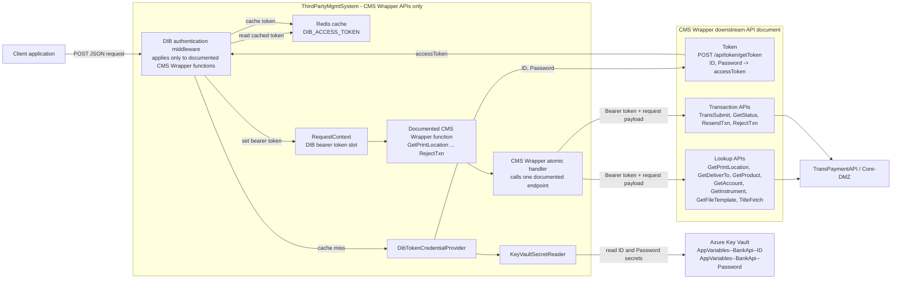
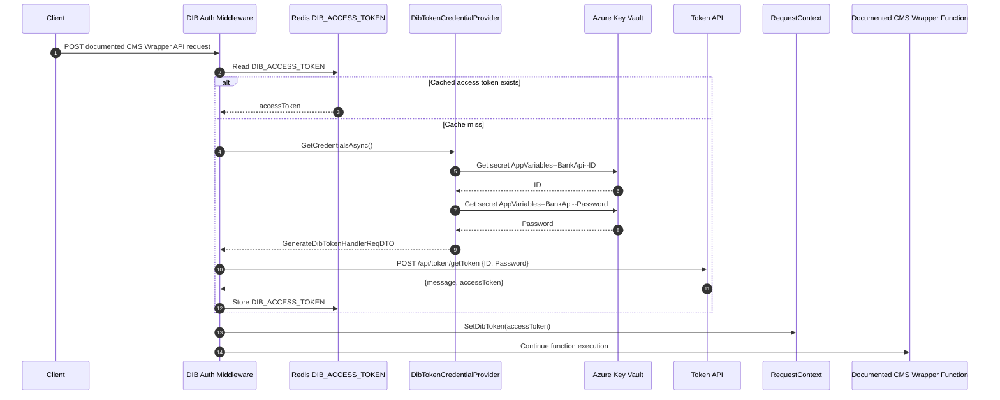
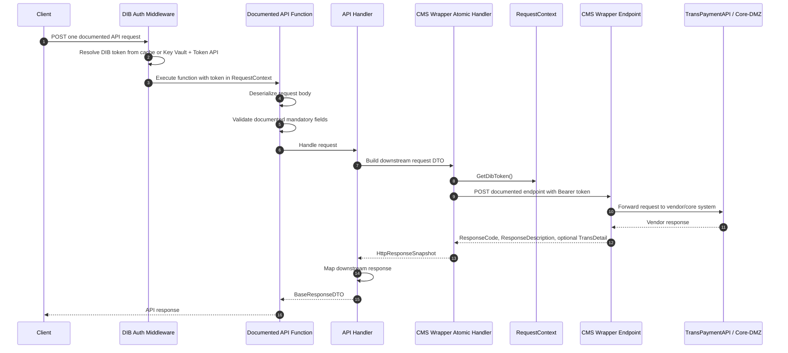
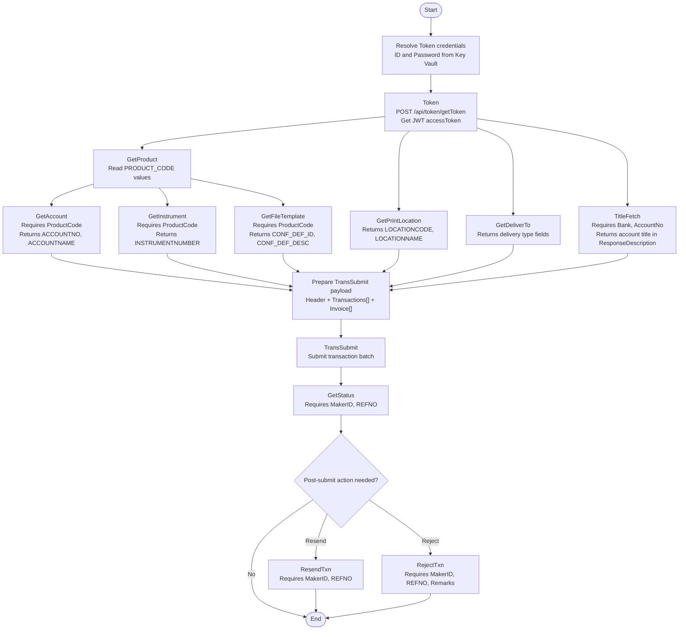
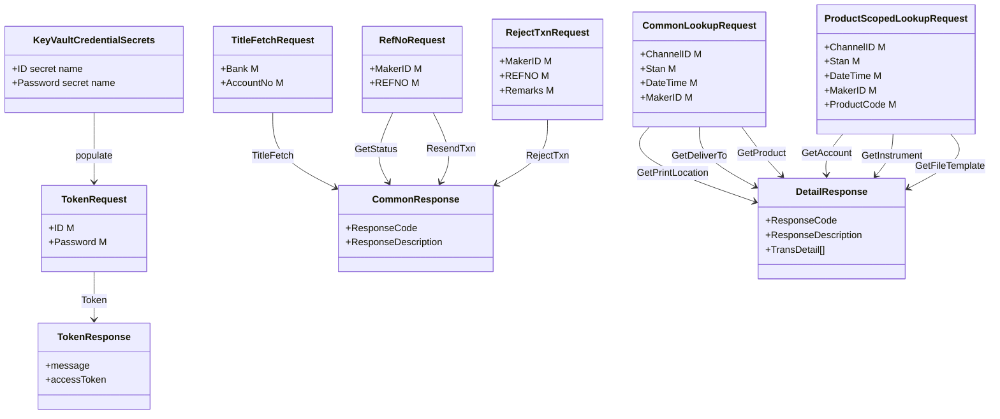
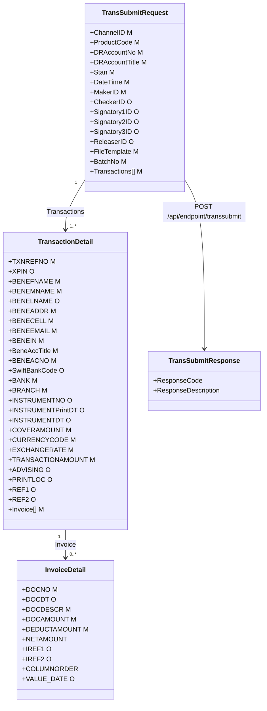
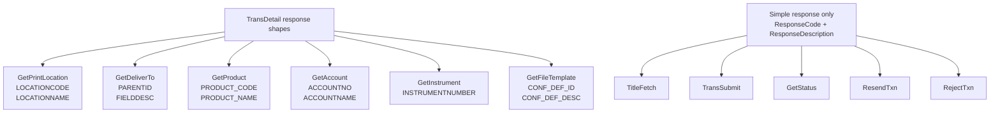

# CMS Wrapper API - Updated Low Level Diagram

Source: `CMSWrapperAPI.pdf`

Scope: This document diagrams only the APIs explicitly listed in the supplied API document and the authentication path required to call those APIs. It does not add Chargemod, Emirates, vehicle recovery, station, database, queue, or any other non-CMS Wrapper API flow.

## Documented API Set

| API | Purpose | Documented endpoint |
| --- | --- | --- |
| Token | Generate JWT bearer token | `POST /api/token/getToken` |
| GetPrintLocation | Get print locations for cheque and pay order | `POST /api/endpoint/getprintlocation` |
| GetDeliverTo | Get delivery types | `POST /api/endpoint/getdeliverto` |
| GetProduct | Get product list | `POST /api/endpoint/getproduct` |
| GetAccount | Get account list for product | `POST /api/endpoint/getaccount` |
| GetInstrument | Get instrument number | `POST /api/endpoint/getinstrument` |
| GetFileTemplate | Get file template list | `POST /api/endpoint/getfiletemplate` |
| TitleFetch | Fetch account title | `POST /api/endpoint/titlefetch` |
| TransSubmit | Submit transaction | `POST /api/endpoint/transsubmit` |
| GetStatus | Get transaction status | `POST /api/endpoint/getstatus` |
| ResendTxn | Resend transaction | `POST /api/endpoint/resendtxn` |
| RejectTxn | Reject transaction | `POST /api/endpoint/rejecttxn` |

Document notes:

- The Web Service URL table lists `TitleFetch` as `/api/endpoint/titlefetch`, while section `4.4.8` shows `/api/endpoint/getfiletemplate`. This diagram uses `/api/endpoint/titlefetch` from the API list.
- The Web Service URL table lists `ResendTxn` as `/api/endpoint/resendtxn`, while section `4.4.11` shows `/api/endpoint/getstatus`. This diagram uses `/api/endpoint/resendtxn` from the API list.
- Section `4.4.12` labels `RejectTxn` purpose as "Resend Transaction", but the API name, endpoint, request, and response describe rejection. This diagram treats it as reject transaction.

## Updated Authentication Boundary

The CMS Wrapper `Token` API still receives `ID` and `Password` as required by the API document. The updated implementation resolves those credentials from Key Vault before invoking `POST /api/token/getToken`.

## Token Acquisition Sequence

## Common API Runtime Sequence

This sequence applies to the eleven documented business APIs after the bearer token is available.

## Documented API Fan-Out

```mermaid
flowchart TD
    TokenReady["DIB accessToken ready<br/>from Redis or Token API"]

    subgraph Lookup["Lookup APIs from document"]
        PrintLocation["GetPrintLocation<br/>POST /api/endpoint/getprintlocation"]
        DeliverTo["GetDeliverTo<br/>POST /api/endpoint/getdeliverto"]
        Product["GetProduct<br/>POST /api/endpoint/getproduct"]
        Account["GetAccount<br/>POST /api/endpoint/getaccount"]
        Instrument["GetInstrument<br/>POST /api/endpoint/getinstrument"]
        FileTemplate["GetFileTemplate<br/>POST /api/endpoint/getfiletemplate"]
        TitleFetch["TitleFetch<br/>POST /api/endpoint/titlefetch"]
    end

    subgraph Transaction["Transaction APIs from document"]
        TransSubmit["TransSubmit<br/>POST /api/endpoint/transsubmit"]
        GetStatus["GetStatus<br/>POST /api/endpoint/getstatus"]
        ResendTxn["ResendTxn<br/>POST /api/endpoint/resendtxn"]
        RejectTxn["RejectTxn<br/>POST /api/endpoint/rejecttxn"]
    end

    TokenReady --> PrintLocation
    TokenReady --> DeliverTo
    TokenReady --> Product
    TokenReady --> Account
    TokenReady --> Instrument
    TokenReady --> FileTemplate
    TokenReady --> TitleFetch
    TokenReady --> TransSubmit
    TokenReady --> GetStatus
    TokenReady --> ResendTxn
    TokenReady --> RejectTxn
```

## Transaction Lifecycle Using Documented APIs Only

## Request Shape Diagram

## TransSubmit Low-Level Payload

## Response Detail Catalog

