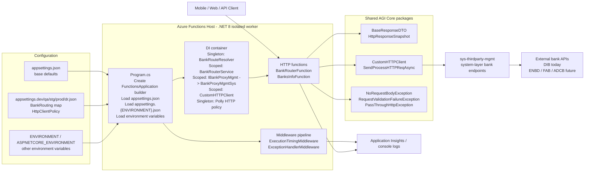
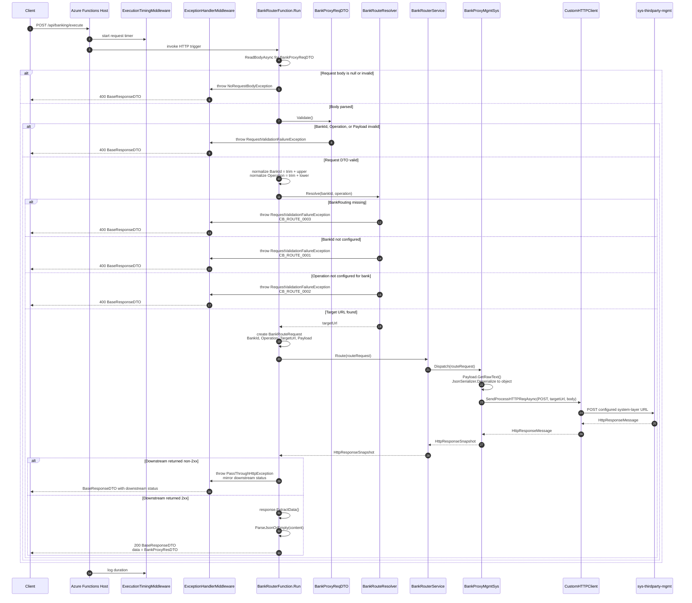
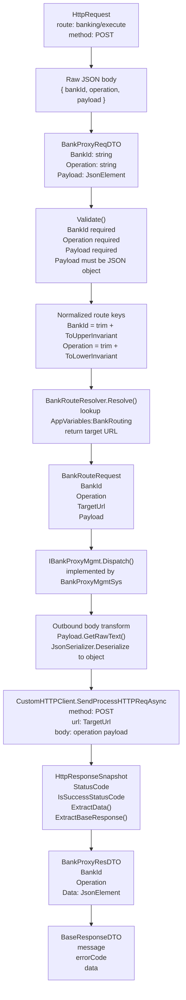
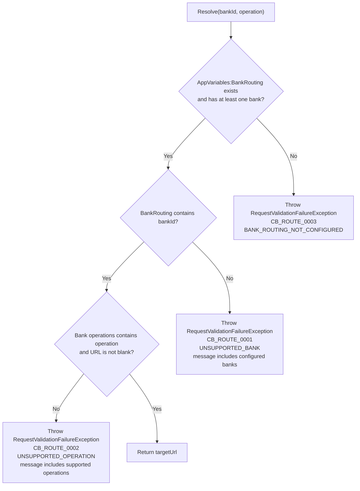
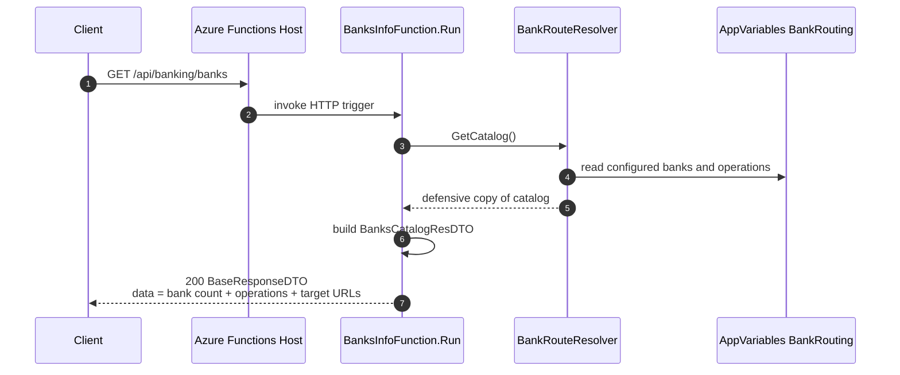
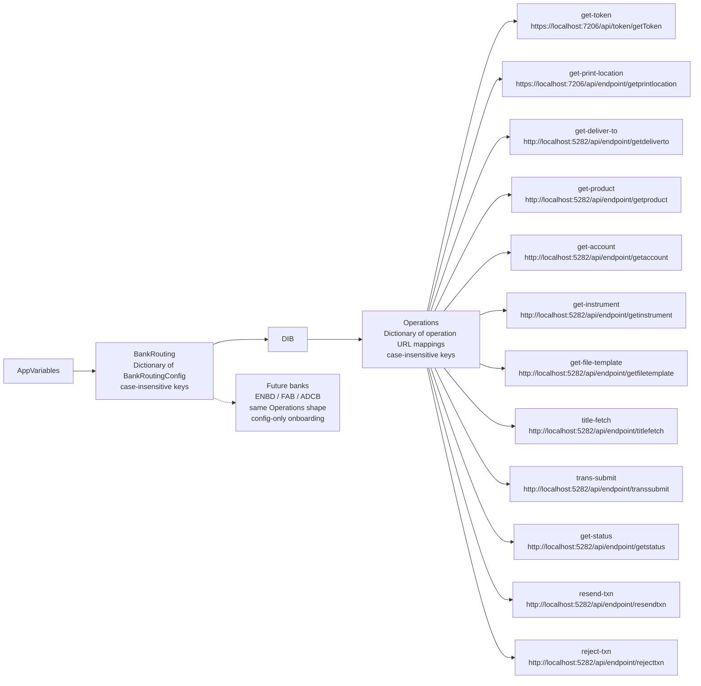
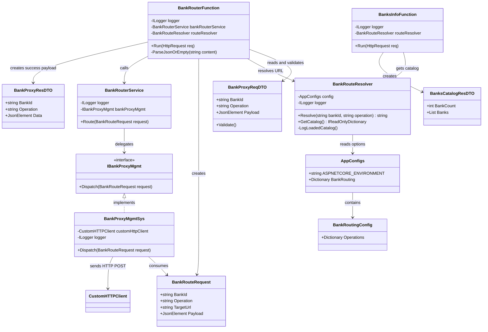
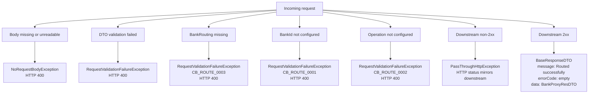

# proc-bank - Low-Level Diagram

This document captures the low-level design of the `proc-bank` Azure Functions
app. It focuses on runtime composition, object handoffs, route resolution,
downstream dispatch, discovery, and error paths.

## Scope

- Application: `Bank/` .NET 8 Azure Functions isolated worker app.
- Primary endpoint: `POST /api/banking/execute`.
- Discovery endpoint: `GET /api/banking/banks`.
- Source of truth for routing: `AppVariables:BankRouting` in
  `appsettings.{environment}.json`.
- Persistence: none. This service does not own a database.
- Bank-specific business logic: delegated to `sys-thirdparty-mgmt`.

## 1. Runtime Composition

## 2. POST `/api/banking/execute` Low-Level Sequence

## 3. Execute Endpoint Object Handoff

## 4. Route Resolution Decision Tree

## 5. GET `/api/banking/banks` Discovery Flow

## 6. Config-Driven Routing Map

## 7. Main Code-Level Dependencies

## 8. Error and Response Paths

## 9. Low-Level Design Notes

- `BankRouterFunction` owns request parsing, validation invocation,
  normalization, response shaping, and downstream failure pass-through.
- `BankProxyReqDTO.Validate()` only validates the generic routing envelope.
  Operation-specific payload validation is intentionally owned by the system
  layer.
- `BankRouteResolver` owns all route lookup behavior and startup catalog
  logging. It does not know about specific banks at compile time.
- `BankRouterService` is a thin orchestration point for future process-layer
  logic such as metrics, branching, or multi-bank workflows.
- `BankProxyMgmtSys` is the HTTP adapter to `sys-thirdparty-mgmt`; it converts
  the `JsonElement` payload back to an object and posts it to the resolved URL.
- `CustomHTTPClient` and the registered Polly policy own outbound HTTP retries,
  timeout behavior, correlation propagation, and standard process-layer logging.
- Adding a bank or operation normally changes only `appsettings.{env}.json`.
  Constants and enums are convenience symbols, not resolver requirements.
